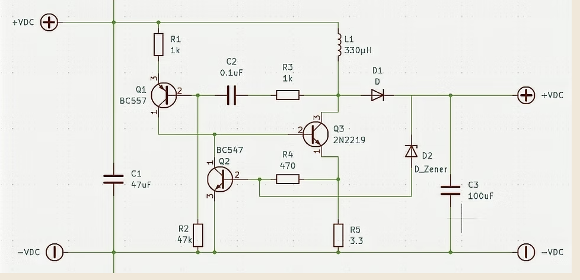
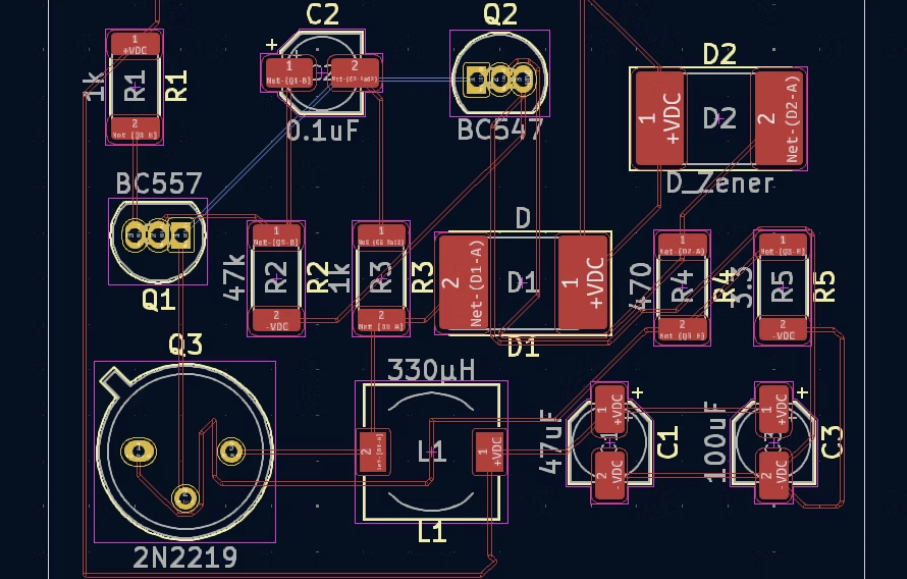
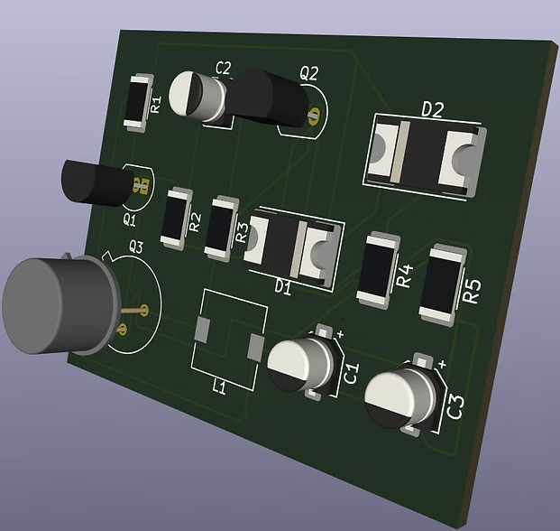
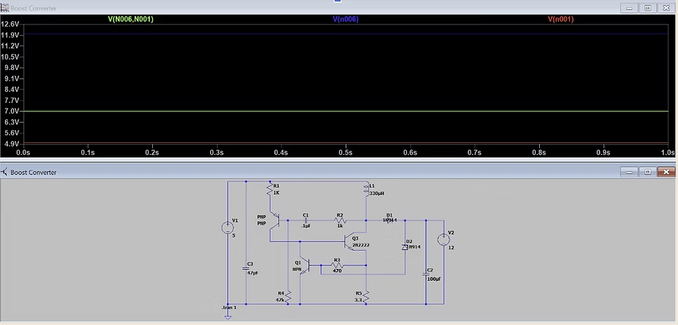

# WindBorne Systems — Sensors Intern Application
**Joel Jaison Manjaly**  
joelmjaison@gmail.com | [LinkedIn](https://linkedin.com/in/joel-manjaly) | [Portfolio](https://joelmjaison.github.io)

---

## About Me
I am an Electrical Engineering student at the University of Texas at Dallas with hands-on experience across the full hardware stack, from PCB design and embedded firmware to ASIC layout and simulation. I have built hardware from scratch in both academic and team settings, and I enjoy working on systems where the physics, the circuit, and the real world all have to agree.

---

## Hardware Submission: SAE Boost Converter PCB
Designed for the Formula SAE electric vehicle at UT Dallas. The board steps up voltage using a self-oscillating transistor topology. Every stage was completed by me: part selection, schematic capture, LTSpice simulation, KiCAD layout, and ERC/DRC validation.

---

### Schematic

The circuit uses a BC557 (Q1) and BC547 (Q2) transistor pair to generate a self-oscillating switching signal, which drives a 2N2219 power transistor (Q3) to switch current through a 330μH inductor (L1). A Schottky diode (D1) rectifies the boosted voltage, a Zener diode (D2) clamps the output for regulation, and capacitors C1 and C3 handle input filtering and output smoothing respectively.

---

### KiCAD PCB Layout

---

### 3D Board Render

---

### LTSpice Simulation

The simulation confirms stable output voltage regulation at approximately 7V across the full 1-second transient window, validating the Zener clamping behavior and oscillator stability before committing to fabrication.

---

## Engineering Screen Questions

### 1. Particularly Interesting Component: 330μH Inductor (L1)
The inductor is the heart of the boost converter and the component I find most interesting. Its operating principle relies on the fundamental property of inductors to oppose changes in current.

When the switching transistor Q3 turns on, current flows through L1 and energy is stored in its magnetic field. When Q3 turns off, the magnetic field collapses and the inductor releases that stored energy, forcing current to continue flowing through diode D1 into the output capacitor C3. This energy transfer is what produces an output voltage higher than the input, following the relationship:

**Vout = Vin / (1 - D)**

where D is the duty cycle of the switching signal. The oscillator formed by Q1 and Q2 generates this switching signal autonomously, with the RC network setting the frequency. The Zener diode D2 then clamps the output, providing regulation without a dedicated feedback IC.

What makes the inductor particularly satisfying is that it bridges two domains — the electrical and the magnetic — in a way that feels almost counterintuitive until you understand it. The energy is invisible while it is stored, and the voltage spike on release is the inductor insisting that current must continue to flow.

---

### 2. Feature Designed for Ease of Use: Self-Oscillating Transistor Feedback Loop
Rather than relying on an external microcontroller or PWM signal to drive the switch, the design uses a self-oscillating feedback loop between Q1 and Q2 to generate the switching signal internally.

This was a deliberate design choice to keep the board fully standalone with no firmware dependency — power it up and it runs. The RC timing components were selected to set the oscillation frequency within a range that maximizes inductor energy transfer efficiency for the target load. This also simplified PCB routing significantly since there is no need for a dedicated controller IC, gate driver, or decoupling network for a digital signal.

The tradeoff is less precise frequency control compared to a microcontroller-driven design, but for the SAE application the simplicity and reliability of a self-contained analog circuit was the right call. If the board ever needed to be handed off to another team member with no embedded experience, it would still work without any software setup.

---

*Thank you for your consideration. I am excited about the opportunity to work on sensor manufacturing and calibration at WindBorne and would love to contribute to the constellation's continued growth.*
